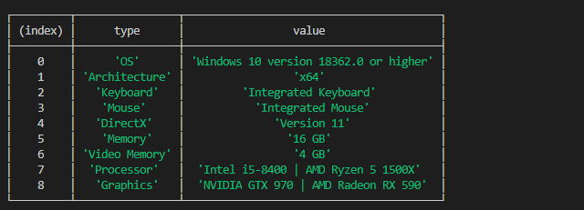

# microsoft-store
This package is a simple package with returns a lot of useful info about xbox and pc games which is available at microsoft store.

# Installing
```bash
npm i microsoft-store
```

# Getting started
```js
const {msStore} = require('microsoft-store')
const store = new msStore()
// searching
const searched = await store.search('flight simulator','pc',1) //query,platfrom (xbox,pc),limit //returns an array[]
store.get(searched.url,true) //url , system_requirements info // returns object
```

# Example


### Supports typescript